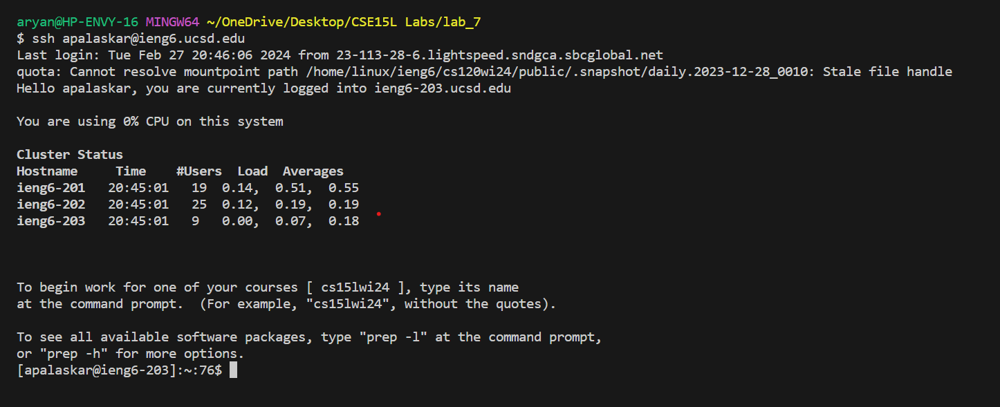
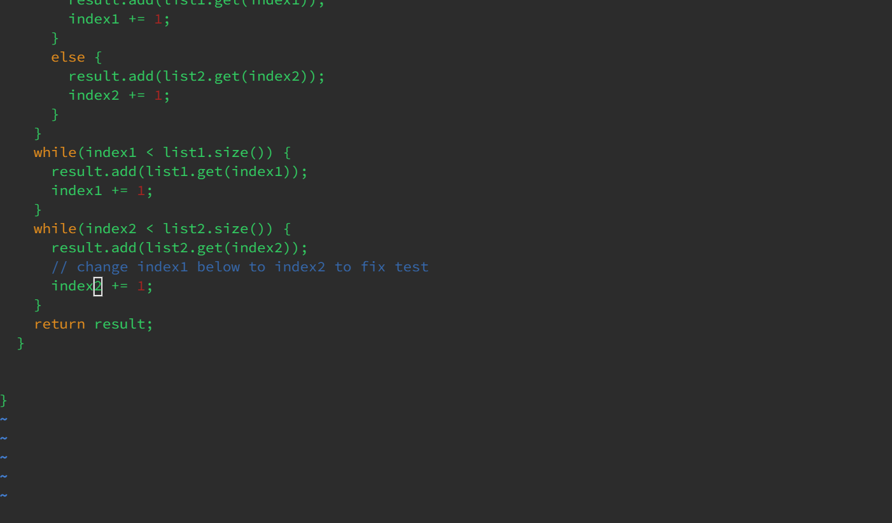

# Lab Report 4
## Step 4

* Typed `ssh <space> apalaskar@ieng6.ucsd.edu` then pressed `<enter>` to log into my `ieng6` account without using password.
* Used `ssh` to securely log into my `ieng6` account. 

## Step 5

* Used `Ctrl-C` to copy the `SSH` url of the forked repository. Then in the terminal typed `git <space> clone <space>` the pressed `Ctrl-V` to paste the `ssh` url.
* The `git clone` command is used to clone the contents of the forked repo into `ieng6` directory for us to work and modify it. 

## Step 6 

* Typed `bash <space> test.sh` to run the tests on the file `ListExamples`.
* The test returned an error from the test `testMerge2`.

## Step 7

* Typed `vim <space> ListExamples.java` to open the file in vim.
* `43 <J>` then `<e>` then `<x>` then `<i>` then `<2>` then `<Ctrl-C>` then `<:wq>`.
*  After entering vim editor I pressed `<J>` key 43 times to move the cursor down to the line I want to edit.
*  `<e>` was pressed to jump to the end of the word `index1` so the cursor is on `1`.
*  `<x>` was pressed to delete `1`.
*  `<i>` was pressed to enter `insert` mode in vim.
*  `<2>` key was pressed to insert `2` at the same position where we deleted `1`.
*  `<Ctrl-C>` was pressed to exit `insert` mode in vim.
*  `<:wq>` was types to save and quit the file. 
